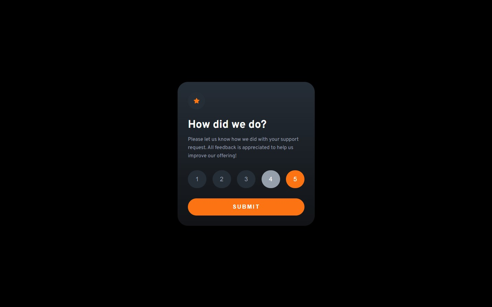
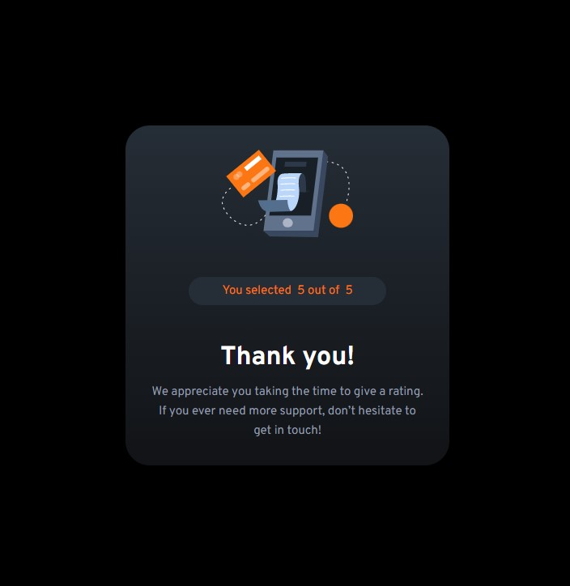

# Frontend Mentor - Interactive rating component solution

This is a solution to the [Interactive rating component challenge on Frontend Mentor](https://www.frontendmentor.io/challenges/interactive-rating-component-koxpeBUmI).

## Table of contents

- [Overview](#overview)
  - [The challenge](#the-challenge)
  - [Screenshot](#screenshot)
  - [Links](#links)
- [My process](#my-process)
  - [Built with](#built-with)
  - [What I learned](#what-i-learned)
- [Author](#author)

## Overview

### The challenge

Users should be able to:

- View the optimal layout for the app depending on their device's screen size
- See hover states for all interactive elements on the page
- Select and submit a number rating
- See the "Thank you" card state after submitting a rating

### Screenshot




### Links

- Solution URL: [https://github.com/DHolets99/Interactive-rating-component]
- Live Site URL: [https://dholets99.github.io/Interactive-rating-component]

## My process

### Built with

- Semantic HTML5 markup
- CSS custom properties
- Flexbox
- Mobile-first workflow

### What I learned

I have improved my skills in JS. Especially in cases where event listeners and bubbling should be used.


```js
const proudOfThisFunc = () => {
  console.log('🎉')
}
```


## Author

- Website - [dholets99](https://dholets99.github.io/Interactive-rating-component/)
- Frontend Mentor - [@DHolets99](https://www.frontendmentor.io/profile/DHolets99)

